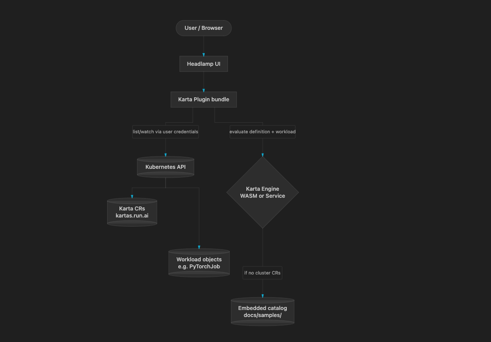
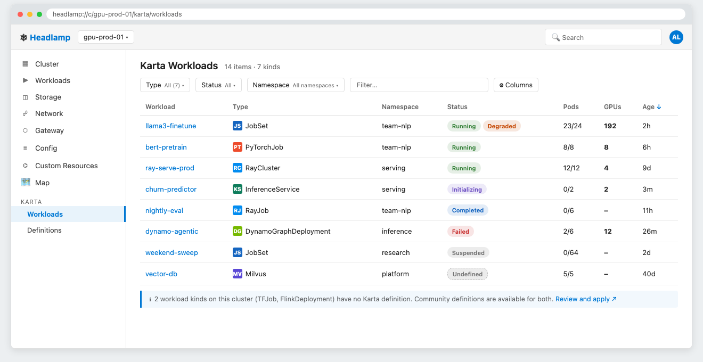
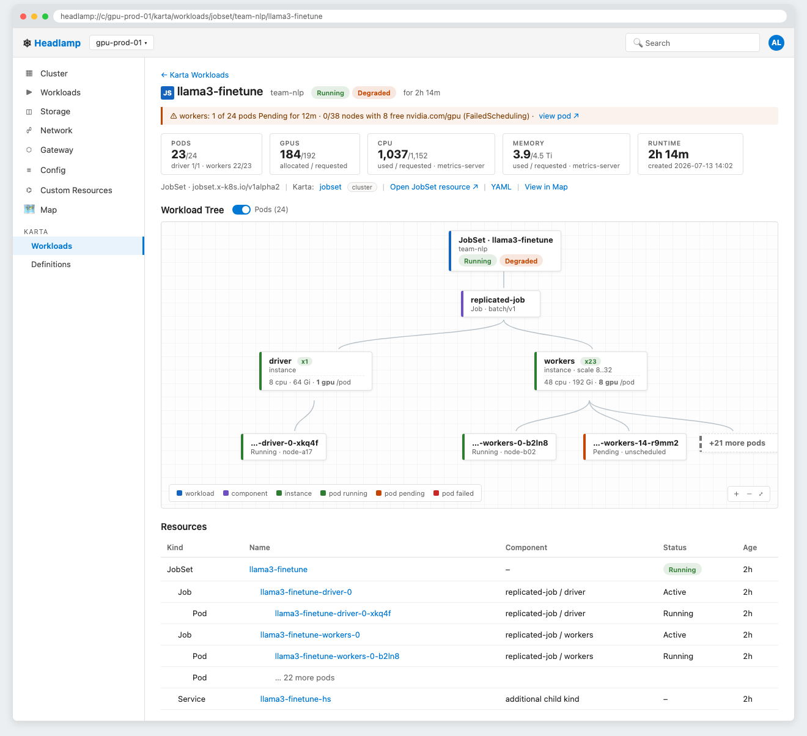

<!-- SPDX-License-Identifier: Apache-2.0 -->
<!-- Copyright (c) 2026 NVIDIA Corporation -->

# Karta Headlamp Plugin — Design Doc

## 1. Context and background

Karta is a Kubernetes framework for describing and normalizing heterogeneous workload types (PyTorchJob, LWSJob, RayJob, etc.) through a unified CRD (`kartas.run.ai`). Each Karta CR defines a workload kind's component hierarchy, pod attribution rules, and status mappings — producing a normalized phase set (`Running`, `Degraded`, `Suspended`, etc.) regardless of the underlying framework.

[Headlamp](https://headlamp.dev) is a CNCF-sandbox extensible Kubernetes UI. Plugins ship as JS bundles loaded at runtime, use only public extension points, and access Kubernetes through the user's existing credentials and RBAC.

Today there is no GUI for Karta workload trees. Users can inspect Karta CRs and workload objects individually through `kubectl` or Headlamp's generic CR browser, but there is no view that shows the component hierarchy, normalized status phases, resource breakdown, or live instance counts across all Karta-described kinds.

---

## 2. Glossary


| Term                          | Definition                                                                                                                                                                |
| ----------------------------- | ------------------------------------------------------------------------------------------------------------------------------------------------------------------------- |
| **Karta CR**                  | A `kartas.run.ai` custom resource that describes a workload kind's component hierarchy, pod attribution rules, and status mappings                                        |
| **Karta engine**              | The computation layer (`pkg/tree`, `pkg/resource`) that evaluates a Karta definition against a live workload object to produce a tree, pod attribution, and status phases |
| **WASM engine**               | Karta's Go engine compiled to WebAssembly, bundled with the plugin and evaluated in the browser                                                                           |
| **Embedded catalog**          | Karta definition catalog (`docs/catalog/`) bundled inside the engine, used as fallback when the cluster has no Karta CRs installed                                        |
| **Status chips**              | UI chips rendering the 9 normalized Karta phases (`Running`, `Degraded`, `Suspended`, etc.) in severity order                                                             |
| **Headlamp deployment modes** | The desktop app deployment variant of Headlamp (Electron, runs locally). The Plugin Catalog and Artifact Hub integration are supported only in this mode.                 |


---

## 3. Proposed design — high level

The plugin is a standard Headlamp JS bundle loaded at runtime with no server-side dependencies — all reads go through Headlamp's existing list/watch hooks using the user's own credentials. Karta's computation logic is consumed via a bundled WASM engine. Definitions are sourced from Karta CRs in the cluster when available, falling back to the embedded catalog.

The plugin adds three views for v1:


| View            | Route                                      | Description                                                                                                            |
| --------------- | ------------------------------------------ | ---------------------------------------------------------------------------------------------------------------------- |
| Workloads       | `/karta/workloads`                         | Unified table across all Karta-described kinds: Name, Kind, Namespace, Status chips, Age                               |
| Workload Detail | `/karta/workloads/:gvk/:namespace/:name` | Header with status chips, vitals tiles (pods, GPUs, CPU, memory, runtime), interactive flow graph, flat resource table |
| Definitions     | `/karta/definitions`                       | Karta CRs table: Name, Workload Kind, Components, Instances (live count), Ready (operator condition), Age              |


Map integration (R3) and Custom Resources page enrichment (R4) are out of scope for v1 — both are P2 (post-v1).

### 3.1 Deployment modes

Headlamp supports two deployment modes: **desktop app** and **in-cluster**. This plugin targets the desktop app — the Plugin Catalog (through which the plugin is distributed via Artifact Hub) is supported only in this mode. In-cluster mode supports plugins but via a different installation process that is out of scope for this document.

**Plugin installation** ([guide](https://headlamp.dev/docs/latest/installation/desktop/plugins-install-desktop)) — installed via the Plugin Catalog UI (Settings → Plugins → search "Karta") or by manually extracting the tarball to `~/.config/Headlamp/plugins` (macOS/Linux) or `%APPDATA%/Headlamp/Config/plugins` (Windows). Updates require manual reinstall.

### 3.2 Technology stack


| Dependency                                                                        | Source                                       | Purpose                                                          |
| --------------------------------------------------------------------------------- | -------------------------------------------- | ---------------------------------------------------------------- |
| **[React](https://react.dev)**                                                    | Shared — provided by Headlamp, do NOT bundle | UI framework                                                     |
| **[MUI (Material UI)](https://mui.com/material-ui)**                              | Shared — provided by Headlamp, do NOT bundle | Components (Button, Chip, Table, etc.)                           |
| **[@iconify/react](https://iconify.design/docs/icon-components/react)**           | Shared — provided by Headlamp, do NOT bundle | 200k+ icons                                                      |
| **[react-router-dom](https://reactrouter.com)**                                   | Shared — provided by Headlamp, do NOT bundle | Routing (useParams, useNavigate)                                 |
| **[@kinvolk/headlamp-plugin](https://headlamp.dev/docs/latest/development/api/)** | Shared — provided by Headlamp, do NOT bundle | Headlamp APIs (registerRoute, K8s hooks, Link, SectionBox, etc.) |
| **[@xyflow/react](https://reactflow.dev)**                                        | Bundled — add to `package.json` dependencies | Flow graph / node diagrams for the workload tree (MIT licensed)  |


React is mandatory for this plugin: Headlamp is itself built with React and exposes all its extension points (route registration, sidebar entries, component hooks) as React APIs. A plugin cannot integrate with Headlamp using any other UI framework.

Headlamp loads all plugins synchronously on startup, so bundle size directly affects startup time. Only `@xyflow/react` is bundled; all other dependencies are resolved from Headlamp's shared runtime.

### 3.3 Repo and CI/CD

The plugin lives inside the Karta repo (`headlamp-plugin/`). The following constraints apply:

- **WASM binary not committed** — the WASM binary is not committed to the repository. It is built from the Karta repository (`make plugin-wasm`) and must be present before the plugin can run. Users running the plugin locally must build the binary themselves from the Karta repo.
- **CI shape** — the Go/WASM build step (`make plugin-wasm`) runs before `npm run build` + `npm run package`. Unit tests are gated on plugin directory changes and require the WASM binary to be built first. The WASM build also runs as part of the release process.
- **Independent versioning** — the plugin is versioned independently of the Karta operator. The README carries a compatibility matrix (`plugin x.y supports Karta >= a.b`).
- **Artifacts** — each release publishes a tarball + SHA256 checksum to GitHub Releases, referenced in `artifacthub-pkg.yml`.
- **PR merge policy** — PRs must be reviewed and approved by a frontend developer first, then approved by the Karta team (as project owners) before merging.

---

## 4. Detailed design

### Architecture diagram



### 4.1 Karta Engine Integration

The plugin needs Karta's computation logic for tree building, pod attribution, and ready-count rollups. The flow splits into two concerns:

**Definition mapping** — On startup, the plugin checks whether Karta is installed in the cluster (i.e. the `kartas.run.ai` CRD is present) and re-evaluates on every `kartas.run.ai` CR change (addition or deletion). This is implemented via `useList()` from `@kinvolk/headlamp-plugin`, which keeps the CR list live via a watch — so the active definition set updates automatically when CRs are added or removed without requiring a plugin restart.

- **Karta installed** → merge cluster CRs with the embedded catalog. For any GVK present in both, the cluster CR takes priority and is passed to the WASM engine. For GVKs present only in the embedded catalog (not yet installed on the cluster), the catalog definition is still used. This means the plugin surfaces all Karta-described kinds regardless of whether each one has a cluster CR — cluster and catalog definitions are additive, not mutually exclusive.
- **Karta not installed** → use catalog definitions embedded in the engine (from `docs/catalog/`), so the plugin remains functional with zero Karta CRs in the cluster.

**Computation** (tree building, pod attribution, ready-count rollups, status phase evaluation) — always delegated to the WASM engine regardless of whether Karta is installed. `pkg/tree` + `pkg/resource` are compiled to WebAssembly, bundled with the plugin, and evaluated in the browser.

**Planned WASM interface** — the following Karta packages and their entry points are planned to be exposed to the JS plugin via the WASM module:


| Package        | Responsibility                                                                                                             | Planned entry point                                    |
| -------------- | -------------------------------------------------------------------------------------------------------------------------- | ------------------------------------------------------ |
| `pkg/tree`     | Given a Karta definition CR and a live workload object, builds the component/instance tree with parent-child relationships | `BuildTree(definition, workload)`                      |
| `pkg/resource` | Attributes pods to tree nodes via ownerRef BFS, computes ready-count rollups per component                                 | `AttributePods(tree, pods)`, `RollupReadyCounts(tree)` |
| `pkg/status`   | Evaluates status phase mappings defined in the Karta CR against the workload object, returns the matched phase set         | `EvaluatePhases(definition, workload)`                 |


*Note: exact function signatures to be confirmed against the Karta codebase before implementation.*

### 4.2 Frontend detailed design

*To be written as a follow-up document.* This section will cover the frontend code organization in detail: directory and file structure under `headlamp-plugin/src/`, where each piece of logic lives (hooks, components, utilities, WASM bindings), and how responsibilities are divided across functions and modules. It is intentionally kept separate from the high-level design so reviewers can go over the implementation structure independently once the high-level is approved.

**Planned file structure:**

```
artifacthub-pkg.yml                   # per-release metadata for Artifact Hub, sibling to headlamp-plugin/
headlamp-plugin/
├── package.json
├── package-lock.json
├── tsconfig.json
├── README.md
├── logo.png
├── locales/                          # i18n strings
├── engine/                           # separate Go module, compiled to WASM
│   ├── go.mod
│   ├── main.go                       # WASM entrypoint, exposes bindings via syscall/js
│   ├── karta.wasm                    # build output, gitignored (`make plugin-wasm`)
│   └── wasm_exec.js                  # build output, gitignored (copied from the Go toolchain)
└── src/
    ├── headlamp-plugin.d.ts          # type shim (present in every Headlamp plugin)
    ├── index.tsx                     # entrypoint — registers routes & sidebar
    ├── utils.ts                      # shared utilities (quantities, flow layout, hierarchy rows)
    ├── lib/
    │   └── engine.ts                 # WASM module loader & bindings
    ├── components/
    │   ├── StatusPhaseChips/
    │   ├── workloads/                # R1 — unified workloads table
    │   ├── workload-detail/          # R2 — detail page (flow graph, vitals, resource table)
    │   └── definitions/              # R5 — definitions view
    ├── hooks/
    │   └── useKartaEngine.ts         # WASM engine hook
    └── resources/                    # TypeScript classes that model Kubernetes CRD objects —
                                      # wrappers around the raw Kubernetes API response that give
                                      # typed access to fields (e.g. .spec.components, .status.conditions)
        ├── karta.ts                  # typed class for the kartas.run.ai CR
        └── workload.ts               # typed wrappers for workload objects (PyTorchJob, LWSJob, etc.)
```

`engine/` is a separate Go module (its own `go.mod`) compiled with `GOOS=js GOARCH=wasm`, kept outside `src/` since it is Go source, not plugin JS/TS. `engine/karta.wasm` and `engine/wasm_exec.js` are not committed — they are build artifacts produced by `make plugin-wasm` and copied into the plugin bundle at build time via the `headlamp.extraDist` entry in `package.json`.

### 4.3 R1 — Unified Workloads Table

A single table showing all live workload instances across all Karta-described kinds.

**Columns:** Name · Kind · Namespace · Status chips · Age

- **Workload list:**
  1. **Karta installed** — kinds are discovered from the `kartas.run.ai` CRs in the cluster and merged with the embedded catalog bundled in the WASM engine (see 4.1's merge behavior).
  2. **Karta not installed** — kinds are discovered from the embedded catalog (`docs/catalog/`) bundled in the WASM engine.
  In both cases, workload instances are fetched via `useList()` from `@kinvolk/headlamp-plugin`, one call per kind, and rendered using MUI `Table`.
- **Status chips** — evaluated by calling `EvaluatePhases()` from the WASM engine (`pkg/status`), rendered as `StatusPhaseChips` component.
- **Hook isolation** — since the number of kinds is data-driven, a dedicated `<KindFetcher>` child component is rendered per kind, each owning exactly one `useList()` call (satisfies React's Rules of Hooks).
- **Built-in kind resolution** — native Kubernetes kinds (batch/v1 Job, apps/v1 Deployment, v1 Pod) are not displayed. Only Karta-described kinds are shown.



### 4.4 R2 — Workload Detail Page

A detail page for a single workload, reached from the workloads table at `/karta/workloads/:gvk/:namespace/:name`. Composed of four parts:

- **Header** — kind icon, name, namespace, status chips, age. Workload object fetched via `useGet()` from `@kinvolk/headlamp-plugin`; status chips evaluated via `EvaluatePhases()` from the WASM engine (`pkg/status`).
- **Vitals tiles** — pods (with per-component breakdown), GPUs, CPU, memory, runtime:
  1. **Pod counts and ready rollups** — computed via `AttributePods()` and `RollupReadyCounts()` from the WASM engine (`pkg/resource`).
  2. **Resource usage (CPU, memory, GPU)** — fetched from `metrics.k8s.io` via `useList()`. Tiles show `n/a` when metrics-server is absent — never 0.
- **Flow graph** — interactive component/instance tree rendered using `@xyflow/react` with a top-down layered layout. Tree built via `BuildTree()` from the WASM engine (`pkg/tree`). Supports a pods toggle; pods are hidden by default and shown per component when toggled on. Caps at 8 pods per instance node to avoid overcrowding — instances with more than 8 pods show the first 8 plus a `+N more` summary node. The full pod list is always available in the resource table below.
- **Resource table** — indented table of all pods attributed to this workload, grouped by Component → Instance → Pod. Pod attribution computed via `AttributePods()` from the WASM engine (`pkg/resource`) using ownerRef BFS traversal. Unattributed pods are grouped in a separate bucket.



### 4.5 R5 — Definitions View

A table listing all Karta CRs in the cluster, giving users visibility into which workload kinds are defined and their live instance counts.

**Columns:** Name · Workload Kind · Components · Instances (live count) · Ready · Age

- **Karta CRs list:**
  1. **Karta installed** — fetched via `useList()` from `@kinvolk/headlamp-plugin` for the `kartas.run.ai` CRD, rendered using MUI `Table`.
  2. **Karta not installed** — definitions are sourced from the embedded catalog (`docs/catalog/`) and displayed with a "source: embedded catalog" label to make it clear they are not cluster CRs.
- **Components column** — parsed directly from the Karta CR spec (no engine call needed).
- **Instances (live count)** — for each Karta CR, a nested `<InstancesCell>` child component calls `useList()` for that workload kind and returns the live count. Uses the same two-component hook pattern as R1 to satisfy React's Rules of Hooks.
- **Ready** — operator condition chip read from the Karta CR status, rendered as a `StatusPhaseChips` component. Three states: green when the operator is running and the condition is Ready; red with a reason + message tooltip when the condition is not Ready; grey "Unknown" with an "operator may not be running" hint when no status condition is present on the CR. The Karta operator is not required for cluster support — the plugin uses this condition when present, never requires it.
- **Error states** — RBAC failure and CRD missing are shown as distinct states, visually different from each other and from zero instances. RBAC failure is an error state (something is wrong). CRD missing is an informational state — expected when using catalog-embedded definitions on a cluster where that workload CRD has not been installed yet (e.g. no operator deployed it); it is not treated as a failure.

### 4.6 Multi-cluster

The plugin operates per-cluster — each cluster has its own Karta CRs, workload instances, and engine state. No cross-cluster aggregation is in scope for v1.

---

## 5. Cross-cutting concerns

### 5.1 Security considerations

The plugin uses the user's own Kubernetes credentials and Headlamp's existing list/watch hooks. No extra service account, ClusterRole, or RoleBinding is required. No secrets are stored or transmitted by the plugin. If the user lacks permissions to list some resources, those resources produce empty output — no explicit error is shown for what they cannot access. Partial access is handled naturally: a user with access to only a subset of namespaces sees only the workloads in those namespaces.

### 5.2 Privacy and data handling

N/A — the plugin reads only Kubernetes resource metadata through the user's own credentials, stores no data, and transmits nothing outside the browser.

### 5.3 Reliability and failure modes


| Failure scenario                      | Behavior                                                                 |
| ------------------------------------- | ------------------------------------------------------------------------ |
| WASM engine fails to load             | Tree views show an error state; workload table phases show "unavailable" |
| `metrics.k8s.io` absent               | Vitals usage tiles show "n/a" — never 0                                  |
| Workload CRD not installed in cluster | Instances column shows `—` with tooltip                                  |
| RBAC blocks a workload kind           | Error state shown for that kind — visually distinct from zero results    |


### 5.4 Performance and scalability

Memoization per `(definition resourceVersion, workload resourceVersion)` keeps repeated evaluations cheap. WASM evaluation is synchronous and single-threaded; at scale (2,000+ workloads) a Web Worker offload may be needed — deferred to post-v1.

---

## 6. Testing strategy


| Level       | What                                                                                                                           | How                            |
| ----------- | ------------------------------------------------------------------------------------------------------------------------------ | ------------------------------ |
| Unit        | Pure logic modules (`flowLayout.ts`, `quantities.ts`, `hierarchyRows.ts`)                                                      | Vitest                         |
| Component   | `StatusPhaseChips` (all 9 phases + severity order), `InstancesCell` (loading / resolved / CRD missing / error)                 | Vitest + React Testing Library |
| Integration | Plugin loaded in Headlamp against a real cluster with Karta CRs                                                                | TBD                             |
| E2E         | Acceptance checks: workloads appear, detail page renders, definitions show live counts, engine produces correct tree | TBD                             |


---

## 7. Installing the plugin in Headlamp

### Desktop app (macOS / Linux / Windows)

The Headlamp desktop app supports installing plugins directly from the UI or by placing a plugin folder in the local plugins directory.

**Via the plugin catalog (once listed on Artifact Hub):**

1. Open Headlamp desktop → Settings → Plugins.
2. Search for "Karta" and click Install.
3. Restart Headlamp.

### Development mode

```bash
cd headlamp-plugin/
npm install
npm start   # watches for changes and serves the plugin on localhost
```

Open the Headlamp desktop app — it picks up plugins in development mode automatically from the local plugins directory.

---

## 8. Rollout and migration plan

### 8.1 Backwards compatibility

The plugin is versioned independently of the Karta operator. The README carries a compatibility matrix (`plugin x.y supports Karta >= a.b`). The current cluster stamps `run.ai/karta-*` labels on Karta CRs; the planned rename to `karta.run.ai/*` must be handled during transition — the plugin reads both label schemes until the old one is fully retired.

### 8.2 Upgrade / downgrade procedure

The plugin is distributed as a Headlamp plugin tarball. Upgrade = install newer tarball. Downgrade = install older tarball. No persistent state or migrations — the plugin is stateless.

---

## 9. Appendix

### A. Karta status phases


| Phase          | Severity    | Chip color                                 |
| -------------- | ----------- | ------------------------------------------ |
| `Failed`       | 1 (highest) | error (red)                                |
| `Degraded`     | 2           | warning (orange)                           |
| `Suspending`   | 3           | warning (orange)                           |
| `Resuming`     | 4           | info (blue)                                |
| `Suspended`    | 5           | secondary (grey-blue)                      |
| `Initializing` | 6           | secondary (grey)                           |
| `Running`      | 7           | success (green)                            |
| `Completed`    | 8           | info (blue)                                |
| `Undefined`    | 9 (lowest)  | grey + tooltip "no status mapping matched" |


Chips render ALL matched phases in severity order (adverse first). A workload can match multiple phases simultaneously.

### B. CRD label scheme


| Label (current)        | Label (planned)        | Value                               |
| ---------------------- | ---------------------- | ----------------------------------- |
| `run.ai/karta-group`   | `karta.run.ai/group`   | API group of the root workload kind |
| `run.ai/karta-version` | `karta.run.ai/version` | API version                         |
| `run.ai/karta-kind`    | `karta.run.ai/kind`    | Kind name                           |


The plugin reads both schemes during the transition period until `run.ai/karta-*` is fully retired.