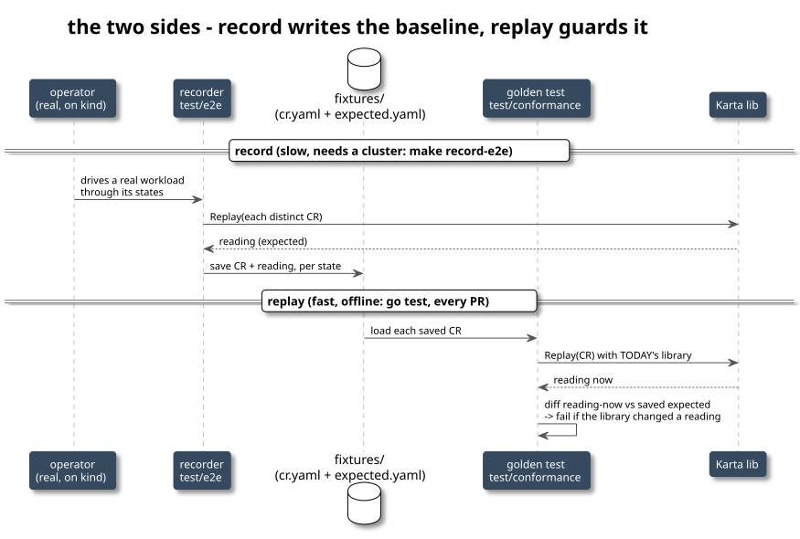
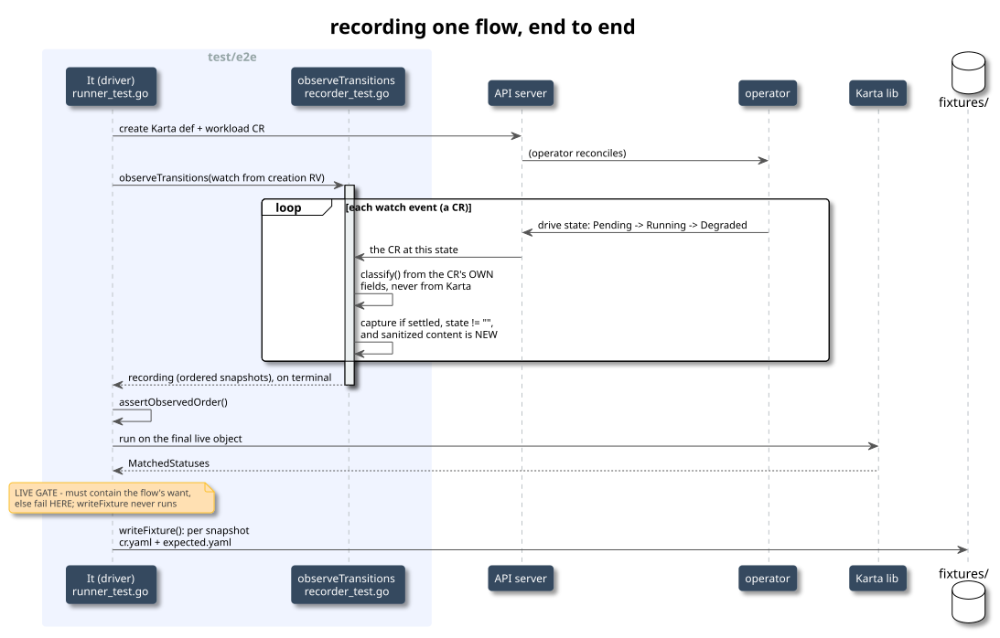
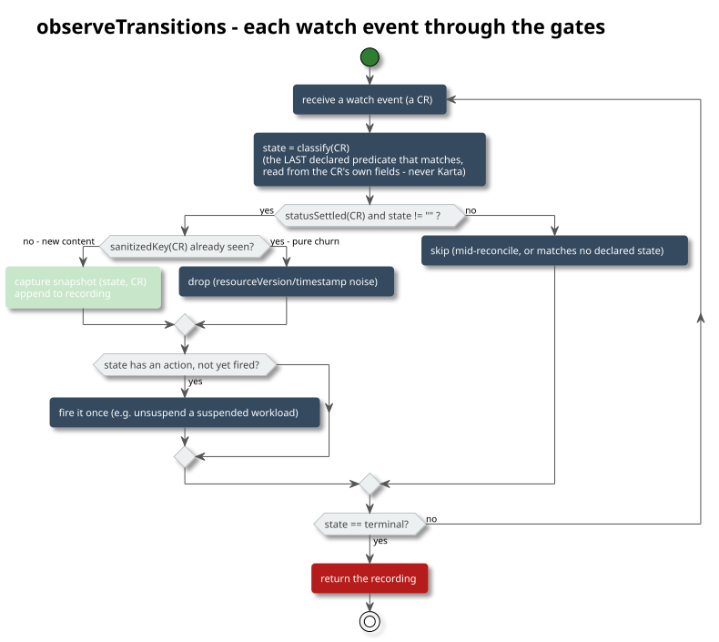
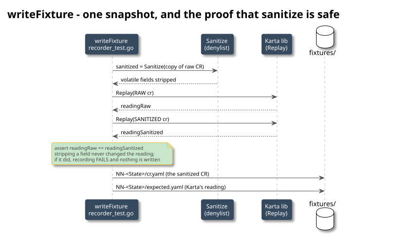

<!-- SPDX-License-Identifier: Apache-2.0 -->
<!-- Copyright (c) 2026 NVIDIA Corporation -->

# how the recording works - the code, end to end

this document traces the `make record-e2e` path line by line with the real code, so you
can stand behind every decision it makes. it covers ONLY recording (the replay/golden side
is in the other doc). the whole job of recording is: drive a real workload with its real
operator, and for every distinct state it passes through, save two things - the workload's
raw CR, and what the Karta library read from it. those saved pairs are what golden replays
offline forever after.

all line numbers are the current code: `test/e2e/{recorder,runner,predicates}_test.go` (the
recorder suite, a separate go module) and `test/conformance/*.go` (the shared replay engine).
the files split by role: `predicates_test.go` (how a state is recognized), `runner_test.go`
(what a case is + the ginkgo driver), `recorder_test.go` (the watch/capture/write engine).



---

## primitives - the kubernetes ideas the recorder stands on (read first)

if any term in the code felt hand-wavy - resourceVersion, watch, generation, GVK - read
this once. every idea here shows up by name in the recorder, and the flow does not click
until these do. concrete over formal.

### a kubernetes object = spec + status

every object (a Pod, a RayJob, a Karta definition) is one yaml/json document with two parts:

- **spec** = what you WANT. you write it; it does not change unless you change it.
- **status** = what IS. the controller writes it as reality moves; you never write status.

a Deployment: `spec.replicas: 3` ("i want 3") vs `status.readyReplicas: 2` ("2 are up so
far"). the recorder only ever reads STATUS to judge a state, and every predicate in
`predicates_test.go` is "look at some status field".

### the API server is the one front door (etcd is the drawer behind it)

nothing talks to the database directly. every read/write - kubectl, the operator, our
recorder - goes through the **API server**, which stores objects in **etcd** (a key/value
store). "the cluster state" just means the set of objects currently in the API server.

### resourceVersion (RV) - the version stamp on every object

the one you asked about, so the long version.

every object carries `metadata.resourceVersion`, a short opaque string like `"471293"`.

- it **changes on every write to that object** - spec OR status, even a no-op re-save. any
  change at all => a new RV.
- it is **opaque**: treat it as a token, compare only for equality, never parse it or do
  `<` / `>` on it. (under the hood it is etcd's global revision counter, so it does increase
  over time, but you are not allowed to rely on that.)
- the API server also understands it as a **global cursor**: "the state of the world as of
  RV X".

it exists for two jobs:

1. **optimistic concurrency (no locks).** to update an object you send back the RV you read.
   the write is accepted only if the object still has that RV; if someone wrote in between
   (RV moved on), you get a conflict and re-read. that is how many writers stay safe without
   locking.
2. **a watch cursor.** you can ask the API server "stream me every change to these objects
   SINCE RV X". that is exactly what the recorder does.

why the recorder cares, in two exact places:

- **watch from the creation RV.** when the driver creates the workload, the API server
  returns it stamped with its birth RV. the recorder starts its watch from that RV
  (`initialRV`), so nothing between "created" and "first event i handle" is missed - the
  server replays everything after that point.
- **sanitize STRIPS resourceVersion, and dedup happens after sanitize.** because RV changes
  on literally every write, two CRs that represent the SAME real state can differ ONLY in
  their RV. that difference is pure noise - it says nothing about the workload. so `Sanitize`
  deletes `resourceVersion`, and `sanitizedKey` (the dedup key) is computed on the sanitized
  object. result: two events that differ only in RV get the same key and the second is
  dropped. if we did NOT strip it, every event would look "new", dedup would never fire, and
  a re-record could never match a previous one.

### CRD and CR - custom kinds

the API server natively knows the built-in kinds (Pod, Job, Deployment, StatefulSet,
CronJob). an operator teaches it NEW kinds with a **CRD** (CustomResourceDefinition) - a
schema registration for, say, `RayJob` or `NIMService`. an instance of a custom kind is a
**CR** (custom resource). in our system both the workloads (RayJob, NIMService, ...) and the
Karta definition itself are CRs; the built-in workloads are just native objects. the
recorder does not care which - see "unstructured" below.

### controllers / operators / reconcile - who actually moves the workload

a **controller** is a program that watches objects and nudges reality toward their spec, in
a loop. one turn of that loop is a **reconcile**: read desired vs actual, take one step,
write status. an **operator** is a controller for a specific app/CRD (the KubeRay operator
turns a RayJob into a RayCluster into pods). the point for us: the recorder does NOT drive
the workload - it creates the object and then WATCHES; the operator is what pushes it
Pending -> Running -> Completed. the recorder is a spectator with a notebook.

### generation vs observedGeneration - "has the controller caught up?"

- `metadata.generation` - a counter the API server bumps every time the **spec** changes
  (never for status). it labels "which version of the desired state this is".
- `status.observedGeneration` - the controller writes "i have finished reconciling up to
  generation N".
- when `observedGeneration >= generation`, the controller has caught up: the status you see
  reflects the CURRENT spec, not a half-finished reconcile.

`statusSettled` uses exactly this: if both fields exist and `observedGeneration < generation`
the status is mid-flight, so skip it - never record a torn, half-written snapshot. kinds
without these fields (a batch/v1 Job has no observedGeneration) count as "settled" and are
judged by their conditions instead.

### status.conditions - typed status flags

most controllers report progress as a list under `status.conditions`, each entry like
`{type: "Available", status: "True" | "False" | "Unknown", reason: "...", message: "...",
lastTransitionTime: ...}`. the recorder's `condTrue("Available")` / `condFalse(...)`
predicates read these. two sub-fields are per-run noise - `message` (human text that churns,
"2 of 3 updated...") and `lastTransitionTime` (a timestamp) - so sanitize strips them; Karta
reads a condition's type/status/reason, never its message.

### watch - a live feed of changes

three ways to read from the API server: **GET** (one object, now), **LIST** (all matching,
now), **WATCH** (a long-lived stream that pushes an event every time a matching object
changes - ADDED / MODIFIED / DELETED, each event carrying the object at that moment). the
recorder opens a WATCH from the creation RV, so it receives the workload's whole life as a
sequence of MODIFIED events - which IS the sequence of states it records.

### RetryWatcher and bookmarks - surviving an expired watch

a watch is not guaranteed to live forever; the API server keeps only a bounded history and
can close the stream. a plain watch would then just die. `RetryWatcher` wraps it: when the
stream drops it re-opens a new watch starting from the last RV it saw, so a 12-minute
recording survives expiries with no gap. **bookmarks** are lightweight "nothing changed, but
the current RV is Y" events the server sends periodically so a client always has a fresh RV
to resume from. (the recorder ignores frames carrying no workload object - the `if !ok {
continue }` line - which is how it skips bookmark/error frames.)

### field selector - only this one object

the watch is narrowed with a **field selector** `metadata.name == <workload>`, so the stream
delivers events for THIS workload only, not every object of that kind in the namespace.

### GVK, RESTMapping, dynamic client, unstructured - talking to ANY kind with zero per-type code

this quartet is what lets one recorder handle Pod and RayJob and NIMService identically:

- **GVK** = GroupVersionKind, a kind's full name: group `ray.io`, version `v1`, kind
  `RayJob` (built-ins have an empty group, e.g. `""/v1/Pod`).
- the API server exposes each kind at a REST path; **RESTMapping** turns a GVK into that
  path (its "resource", e.g. `rayjobs`). the recorder needs it to know which URL to watch.
- the **dynamic client** (`dynClient`) is a client that works with ANY GVK and hands back
  generic objects instead of typed Go structs.
- **unstructured.Unstructured** is that generic object: literally the yaml/json as a
  `map[string]interface{}`. you read fields by path - `unstructured.NestedString(u, "status",
  "state")`. every predicate does exactly this. because the recorder only ever pokes generic
  maps, a new workload type needs no new Go type and no generated client - just a manifest
  and a predicate.

### where it runs: namespace, kind cluster

- **namespace** = a folder for objects; our workloads live in `default`.
- **kind** = "kubernetes IN docker" - a real but throwaway cluster running inside docker
  containers on the laptop / CI box. `make e2e-up` builds one; the suite runs against it.

### the two clients you see in the code

- `k8sClient` - a controller-runtime client, for Create / Get / Delete and the RESTMapper.
- `dynClient` - the dynamic client, used only for the watch (the watch must work for any kind).

**putting it together in one sentence:** the driver **creates** the object via `k8sClient`;
`observeTransitions` **RESTMap**s its **GVK**, opens a **RetryWatcher** on `dynClient` from
the birth **resourceVersion**, narrowed by a **field selector**, and reads **unstructured**
CRs off the stream; per CR it checks **observedGeneration** (settled?) and the status fields
/ **conditions** (which state?), dedups on the **sanitized** content (RV stripped), and stops
at the terminal.

---

## 0. the 10,000-foot trace

```
make record-e2e
  = KARTA_RECORD=1 make test-e2e
  = go test ./test/e2e  (ginkgo suite, filtered by E2E_LABELS)
        |
        v
  for each workloadCase.run():           runner_test.go:101
    Describe(Ordered):
      BeforeAll: create the Karta definition CR
      It: "operator reconciles"          (waits Validated/CRDExists/Ready)
      for each flow:
        It "flow X":                      runner_test.go:127   <-- the driver
          1. create the workload manifest
          2. observeTransitions(...)      recorder_test.go:126    <-- watch + capture
          3. assertObservedOrder(...)     recorder_test.go:223    <-- order check
          4. run Karta on the live obj, assert want + extracts
          5. writeFixture(...)            recorder_test.go:243    <-- sanitize + write
             (only if KARTA_RECORD=1)
```

steps 1-4 run on EVERY `make test-e2e`. only step 5 is gated on the record env var, so a
plain test run exercises the exact same watch and order check without writing anything.

---

## 1. the driver - what one flow does



`runner_test.go:127`. this is the `It` block that runs per flow. read it top to bottom:

```go
It(fmt.Sprintf("flow %q: maps the live workload to %s", fl.name, fl.want), func() {
    timeout := tc.timeout
    if timeout == 0 {
        timeout = 3 * time.Minute
    }

    obj := &unstructured.Unstructured{}
    Expect(yaml.Unmarshal(mustRead(fl.workloadFile), obj)).To(Succeed())      // (a)
    Expect(client.IgnoreAlreadyExists(k8sClient.Create(ctx, obj))).To(Succeed())
    DeferCleanup(func() { _ = k8sClient.Delete(ctx, obj) })                   // (b)

    By("observing the workload's status transitions")
    rec := observeTransitions(tc, fl, obj, timeout)                          // (c) the core
    assertObservedOrder(fl, rec.order)                                       // (d)

    By("running the Karta library against the live object")
    live := emptyLike(obj)
    Expect(k8sClient.Get(ctx, client.ObjectKeyFromObject(obj), live)).To(Succeed())
    factory := resource.NewComponentFactoryFromObject(karta, live)
    root, err := factory.GetRootComponent()
    Expect(err).NotTo(HaveOccurred())
    status, err := root.GetStatus(ctx)
    Expect(err).NotTo(HaveOccurred())
    Expect(status.MatchedStatuses).To(ContainElement(fl.want))              // (e) the live gate

    for _, ec := range tc.extracts { ... assert components extract ... }     // (f)

    if rec != nil {
        By("recording conformance for the observed states")
        writeFixture(tc, fl, karta, rec)                                     // (g) only writes here
    }
})
```

- (a) the workload is a plain manifest under `testdata/<type>/<flow>.yaml`. it is loaded as
  an `unstructured.Unstructured` - the recorder never needs a typed client for the workload,
  so it works for any kind (Pod, RayJob, NIMService) with zero per-type code.
- (b) `DeferCleanup` deletes the workload when the `It` ends, so flows do not leak into each
  other.
- (c) `observeTransitions` is the whole recording engine (section 2). it returns a `recording`
  - the ordered list of captured CRs.
- (d) `assertObservedOrder` checks the sequence is a legal progression (section 6).
- (e) THE LIVE GATE. after observing, it runs Karta on the final object and asserts
  `MatchedStatuses` contains the flow's declared `want`. this is the safety net: if a flow was
  mis-induced (say it never actually reached Degraded), this fails HERE and `writeFixture`
  never runs - so a wrong fixture is never written.
- (g) `writeFixture` runs LAST, only after (e) and (f) passed, and only under `KARTA_RECORD=1`.
  nothing is recorded from a failing or flaky run.

---

## 2. observeTransitions - the watch loop

`recorder_test.go:126`. this is the heart. it watches the workload and captures a snapshot for
every distinct CR it settles into. three parts: setup, a fast path, and the loop.

### 2a. setup - watch from birth, survive expiry

```go
gvk := obj.GroupVersionKind()
mapping, err := k8sClient.RESTMapper().RESTMapping(gvk.GroupKind(), gvk.Version)  // kind -> REST resource

namespace := obj.GetNamespace()
if namespace == "" { namespace = "default" }

// Watch from the workload's creation resourceVersion so no early state is missed.
initialRV := obj.GetResourceVersion()
if initialRV == "" {
    seed := emptyLike(obj)
    Expect(k8sClient.Get(ctx, client.ObjectKeyFromObject(obj), seed)).To(Succeed())
    initialRV = seed.GetResourceVersion()
}

watcher, err := watchtools.NewRetryWatcherWithContext(ctx, initialRV, &cache.ListWatch{
    WatchFuncWithContext: func(ctx context.Context, opts metav1.ListOptions) (watch.Interface, error) {
        opts.FieldSelector = fields.OneTermEqualSelector("metadata.name", obj.GetName()).String()
        return dynClient.Resource(mapping.Resource).Namespace(namespace).Watch(ctx, opts)
    },
})
defer watcher.Stop()
```

two decisions worth understanding:

- **watch from the creation resourceVersion** (`initialRV`). the `Create` call in the driver
  returned the object with its RV; the watch starts from exactly there. so no state between
  "created" and "first event we process" can slip past - the API server replays from that RV.
- **`NewRetryWatcherWithContext`**, not a plain watch. the API server can expire a watch
  mid-recording (they are not guaranteed to live for minutes). a plain watch would close its
  channel and the loop would spin on a dead channel. the retry watcher transparently
  re-establishes the watch from the last RV it saw, so a 12-minute record survives an expiry.
- the `FieldSelector` on `metadata.name` means the watch only delivers events for THIS
  workload, not every object of that kind in the namespace.

### 2b. the fast path - terminal at birth

```go
rec := &recording{}
seenContent := map[string]bool{}
actioned := map[string]bool{}
var lastSeen *unstructured.Unstructured
terminal := fl.states[len(fl.states)-1].name

// Some workloads reach their terminal state at creation and the controller never
// updates them afterwards (an unfired CronJob keeps an empty status), so a watch
// from the creation resourceVersion would deliver no event to classify.
if statusSettled(obj) && classify(obj, fl.states) == terminal {
    rec.snapshots = append(rec.snapshots, captured{state: terminal, raw: obj.DeepCopy()})
    rec.order = append(rec.order, terminal)
    return rec
}
```

why this exists: a `RetryWatcher` started from the creation RV is EXCLUSIVE of that RV - it
delivers events strictly after it. an unfired CronJob is "terminal" (Karta reads it as
Initializing) the instant it is created and then never changes, so the watch would sit there
forever with nothing to deliver and time out. the fast path captures the create-response
object directly. that object is pre-reconcile, so it is deterministic across re-records.

### 2c. the capture loop



```go
deadline := time.After(timeout)
for {
    select {
    case <-deadline:
        Fail(fmt.Sprintf("workload %s flow %q did not reach %q within %s; observed %v\n...",
            tc.name, fl.name, terminal, timeout, rec.order, dumpStatus(lastSeen)))
    case event, open := <-watcher.ResultChan():
        if !open { Fail("watch closed before terminal state") }
        u, ok := event.Object.(*unstructured.Unstructured)
        if !ok { continue }                 // a bookmark/error frame carries no workload object
        lastSeen = u
        state := classify(u, fl.states)     // (1) judge state from the workload's own fields

        if statusSettled(u) && state != "" {                       // (2) gates
            if key := sanitizedKey(u); !seenContent[key] {         // (3) dedup by content
                seenContent[key] = true
                rec.snapshots = append(rec.snapshots, captured{state: state, raw: u.DeepCopy()})
                rec.order = append(rec.order, state)
            }
            if a := fl.actions[state]; a != nil && !actioned[state] {   // (4) fire action once
                actioned[state] = true
                Expect(a(ctx, obj)).NotTo(HaveOccurred(), "action for state %q", state)
            }
            if state == terminal { return rec }                    // (5) done
        }
    }
}
```

every event runs through five gates. sections 3-5 explain (1)-(4); (5) is just "stop when we
reach the declared terminal state". the `deadline` `Fail` prints `lastSeen`'s status, so a
timeout is debuggable straight from the logs (you see exactly which state it was stuck in).

---

## 3. judging state WITHOUT asking Karta - the anti-circularity rule

this is the single most important property of the recorder. the state a snapshot is labeled
with is decided from the workload's OWN status fields, never by asking Karta. if we asked
Karta "what status is this?" and saved "Karta said Running", the golden test would later be
comparing Karta against its own past answer - it could never catch a regression, because a
broken Karta would have produced a broken baseline too.

### classify (recorder_test.go:69)

```go
func classify(u *unstructured.Unstructured, states []namedState) string {
    name := ""
    for _, s := range states {
        if s.ready(u) {           // s.ready is a predicate over the raw CR
            name = s.name
        }
    }
    return name
}
```

`states` is the flow's declared list, e.g. for batch-job/degraded:

```go
states: []namedState{
    {"Running",  intAtLeast(1, "status", "active")},
    {"Degraded", jobDegraded()},
}
```

classify walks them in declaration order and returns the LAST one whose predicate matches.
declaration order is "least to most advanced", so if both Running and Degraded match, Degraded
(more advanced) wins. a CR that matches nothing returns `""` and is skipped by gate (2).

### the predicates (predicates_test.go)

each predicate is a `readyFunc` - a pure function of the unstructured CR. they read only the
workload's own fields. examples:

```go
func condTrue(condType string) readyFunc {              // a status condition is True
    return func(u *unstructured.Unstructured) bool {
        conds, _, _ := unstructured.NestedSlice(u.Object, "status", "conditions")
        for _, c := range conds {
            if m, ok := c.(map[string]any); ok && m["type"] == condType && m["status"] == "True" {
                return true
            }
        }
        return false
    }
}

func phaseEq(want string, path ...string) readyFunc {   // a string field equals want
    return func(u *unstructured.Unstructured) bool {
        got, _, _ := unstructured.NestedString(u.Object, path...)
        return got == want
    }
}

func intAtLeast(min int64, path ...string) readyFunc {  // an int field is present and >= min
    return func(u *unstructured.Unstructured) bool {
        got, found, err := unstructured.NestedInt64(u.Object, path...)
        return err == nil && found && got >= min
    }
}
```

`jobDegraded()` is a composite in the same style: parallelism > 1, some but not all pods ready,
and at least one already succeeded or failed - a real settled-degraded Job, not a mid-rollout.
the point: these are OUR independent definition of each state, written against the operator's
documented status semantics, so the recording is an independent oracle.

### statusSettled (recorder_test.go:84) - never record a mid-reconcile CR

```go
func statusSettled(u *unstructured.Unstructured) bool {
    gen, hasGen, _ := unstructured.NestedInt64(u.Object, "metadata", "generation")
    obs, hasObs, _ := unstructured.NestedInt64(u.Object, "status", "observedGeneration")
    if !hasGen || !hasObs {
        return true          // no generation tracking (e.g. batch/v1 Job) -> trust its conditions
    }
    return obs >= gen        // status has caught up to spec
}
```

gate (2) `statusSettled(u) && state != ""`. when a CR carries both `metadata.generation` and
`status.observedGeneration`, the status is only trusted once `observedGeneration >= generation`
- i.e. the controller has finished reconciling the current spec. this stops the recorder from
capturing a half-written status mid-reconcile. kinds without generation tracking (Jobs) return
true and are gated instead by their own conditions inside the predicates.

---

## 4. dedup by sanitized content - why we get EVERY distinct CR but no noise

gate (3): `if key := sanitizedKey(u); !seenContent[key]`.

```go
func sanitizedKey(u *unstructured.Unstructured) string {
    c := u.DeepCopy()
    conformance.Sanitize(c)                  // strip volatile fields (section 7/8)
    b, err := json.Marshal(c.Object)         // Go sorts map keys, so this is deterministic
    if err != nil {
        return u.GetResourceVersion()        // fall back to no dedup on the rare marshal error
    }
    return string(b)
}
```

this is the mechanism behind "record every distinct CR, not one per state". the dedup key is
the CR AFTER sanitization, marshaled to JSON. so:

- two events that differ only in `resourceVersion` / timestamps -> same sanitized key -> the
  second is dropped. no noise from pure bookkeeping churn.
- two events that differ in any field Karta could read (a condition flips, a replica count
  moves) -> different keys -> BOTH captured, even if they classify to the same state.

that second case is the whole reason this is not one-snapshot-per-state: a workload that sits
in `Running` across three genuinely different CRs yields three `NN-Running` snapshots, and
golden replays all three. if a future library change would read the middle one as `Degraded`,
the diff catches it. dedup on sanitized (not raw) content matters because that is exactly the
granularity that survives to disk - we do not want a snapshot for a change that sanitize would
erase anyway.

---

## 5. actions - recording a transition the operator will not make itself

gate (4). some flows need US to poke the workload to move it forward - the clearest case is a
resume flow (create suspended, watch it reach Suspended, then unsuspend it, then watch it run
to completion). that mid-flow mutation is a `stateAction`:

```go
if a := fl.actions[state]; a != nil && !actioned[state] {
    actioned[state] = true
    Expect(a(ctx, obj)).NotTo(HaveOccurred(), "action for state %q", state)
}
```

`fl.actions` maps a state name to a mutation fired ONCE (`actioned` guards it) the first time
that state is observed. e.g. `unsuspend` clears `spec.suspend` on the live object. because this
lives inside `observeTransitions`, it runs identically in record and non-record mode, and the
snapshots it triggers (Suspended -> Running -> Completed) are captured like any others.

---

## 6. assertObservedOrder - the transition is a legal progression

`recorder_test.go:223`. after observing, the driver asserts the sequence makes sense:

```go
func assertObservedOrder(fl flow, order []string) {
    seq := conformance.CollapseConsecutive(order)      // Running,Running,Degraded -> Running,Degraded
    idx := map[string]int{}
    for i, s := range fl.states { idx[s.name] = i }
    prev := -1
    for _, name := range seq {
        i, ok := idx[name]
        Expect(ok).To(BeTrue(), "observed undeclared state %q", name)
        Expect(i).To(BeNumerically(">", prev), "state %q observed out of declared order in %v", name, seq)
        prev = i
    }
    Expect(seq).NotTo(BeEmpty(), "no states observed")
    Expect(seq[len(seq)-1]).To(Equal(fl.states[len(fl.states)-1].name), "terminal must be the last observed state")
}
```

`CollapseConsecutive` first squashes the repeated snapshots (from section 4) down to the
distinct-state sequence. then it checks that sequence is a strictly increasing subsequence of
the declared states, ending at the terminal. subsequence (not equality) because a fast workload
may skip a settled intermediate we declared - that is fine. what it catches: an undeclared
state, a state observed out of order (a regression), or ending on the wrong terminal. this runs
in BOTH record and non-record mode, so `make test-e2e` verifies the progression live.

---

## 7. writeFixture - project through Karta, prove sanitize is safe, write



`recorder_test.go:243`. only reached after the live gate passed. per snapshot it does three
things: sanitize, prove the sanitize did not change what Karta reads, and stage it for write.

```go
func writeFixture(tc workloadCase, fl flow, karta *kartav1alpha1.Karta, rec *recording) {
    version := operatorVersion(tc.operator)          // read from hack/e2e .installed-versions

    fixture := conformance.Fixture{
        SchemaVersion:  conformance.SchemaVersion,
        Operator:       tc.operator,
        Version:        version,                      // the version is in the PATH -> old versions kept
        KartaName:      tc.kartaName,
        Flow:           fl.name,
        Want:           fl.want,
        KartaFile:      strings.TrimPrefix(tc.kartaFile, "../../"),
        ObservedStates: conformance.CollapseConsecutive(rec.order),
    }

    data := map[string]conformance.SnapshotData{}
    for i, snap := range rec.snapshots {
        sanitized := snap.raw.DeepCopy()
        conformance.Sanitize(sanitized)                          // (a) strip volatile fields

        rawReading, err := conformance.Replay(karta, snap.raw)   // (b) what Karta reads from the raw CR
        Expect(err).NotTo(HaveOccurred())
        reading, err := conformance.Replay(karta, sanitized)     // (b) ... and from the sanitized CR
        Expect(err).NotTo(HaveOccurred())
        Expect(reading).To(Equal(rawReading),                    // (c) THE PROOF
            "sanitising snapshot %d changed what Karta reads", i)

        dir := conformance.SnapshotDir(i, snap.state)            // "00-Running", "01-Running", ...
        fixture.Snapshots = append(fixture.Snapshots, conformance.Snapshot{State: snap.state, Dir: dir})
        data[dir] = conformance.SnapshotData{CR: sanitized, Expected: reading}
    }

    root := filepath.Join("..", "conformance", "fixtures", tc.operator, version, tc.kartaName, fl.name)
    Expect(conformance.Write(root, fixture, data)).To(Succeed())
}
```

- (c) is the guarantee that makes sanitization SAFE. sanitize is a denylist (section 8) - it
  could, in principle, strip a field Karta actually reads. so the recorder runs Karta twice per
  snapshot: once on the raw CR, once on the sanitized CR, and asserts the two readings are
  identical. if stripping a field changed the reading, recording FAILS here and nothing is
  written. so what lands on disk is guaranteed to read the same sanitized as raw.
- the on-disk `Expected` is `Replay(karta, sanitized)` - Karta's reading. that is what golden
  compares against later.
- `version` comes from `operatorVersion` (`.installed-versions`, written by the provisioner) and
  is a path segment, so recording operator v2 writes a new `.../v2/...` tree and never touches
  v1. keeping current + previous versions is automatic.

---

## 8. Sanitize - the denylist that makes re-records comparable

`test/conformance/sanitize.go:88`.

```go
func Sanitize(u *unstructured.Unstructured) {
    scrub(u.Object)
    unstructured.RemoveNestedField(u.Object, "metadata", "annotations",
        "kubectl.kubernetes.io/last-applied-configuration")   // large, volatile, never read
}

func scrub(v interface{}) {
    switch x := v.(type) {
    case map[string]interface{}:
        for k := range volatileKeys { delete(x, k) }              // drop volatile fields
        for k, placeholder := range normalizeKeys {               // normalize present-but-per-run values
            if _, ok := x[k]; ok { x[k] = placeholder }
        }
        for _, val := range x { scrub(val) }                      // recurse
    case []interface{}:
        for _, val := range x { scrub(val) }
    }
}
```

- `volatileKeys` are fields that differ between two recordings of the SAME real state:
  `resourceVersion`, `uid`, `creationTimestamp`, `managedFields`, condition `message` (live
  rollout text that churns), per-run pod/replicaset names, Ray job ids, Kubeflow
  `replicaStatuses`, and so on. dropping them is what lets a re-record of an unchanged workload
  produce the same tree, and what keeps a golden diff about real changes instead of noise.
- `normalizeKeys` are fields Karta reads for PRESENCE but whose value is a per-run timestamp
  (a CronJob `lastScheduleTime`: Karta reads "running" when it is non-null). deleting them would
  change the reading, so instead their value is replaced with a fixed placeholder - the field
  stays present, the reading is preserved, the byte content is stable.
- it is a DENYLIST on purpose: anything not listed is kept, so a field Karta reads is never
  silently dropped. section 7(c) is the backstop that proves the denylist is safe for each CR.

---

## 9. Replay - the ONE read path shared with golden

`test/conformance/replay.go:19`. this is the function both the recorder (to produce `Expected`)
and the offline golden test (to check it) call. sharing it is what guarantees record and replay
can never diverge.

```go
func Replay(karta *v1alpha1.Karta, obj resource.KubernetesObject) (Expected, error) {
    factory := resource.NewComponentFactoryFromObject(karta, obj)   // the real Karta entry point

    root, _ := factory.GetRootComponent()
    status, _ := root.GetStatus(ctx)

    exp := Expected{}
    if status != nil {
        exp.MatchedStatuses = status.MatchedStatuses    // the ResourceStatus list (Running, Degraded, ...)
        exp.Phase = status.Phase
    }

    children, _ := factory.GetChildComponents()
    for _, c := range append([]*resource.Component{root}, children...) {
        instances, err := c.GetExtractedInstances(ctx)
        if err != nil || len(instances) == 0 { continue }
        // keep only the STABLE signal: sorted instance keys + per-instance scale (replicas)
        ...
        comps[c.Name()] = ComponentReading{Instances: keys, Scale: scale}
    }
    exp.Components = comps
    return exp, nil
}
```

`Expected` deliberately keeps only the stable projection of what Karta read: the matched
statuses, the phase, and per-component sorted instance keys plus scale. it drops the pod specs
and mutated metadata inside the extracted instances, which churn run-to-run and would make
golden diffs noisy. this is the exact object stored as `expected.yaml` and diffed by golden.

---

## 10. Write - the on-disk shape

`test/conformance/fixture.go:110`.

```go
func Write(root string, f Fixture, data map[string]SnapshotData) error {
    if err := os.RemoveAll(root); err != nil { return err }   // clear THIS flow dir's old snapshots
    os.MkdirAll(root, 0o755)
    writeYAML(filepath.Join(root, "fixture.yaml"), f)         // the index
    for _, s := range f.Snapshots {
        d := data[s.Dir]
        dir := filepath.Join(root, s.Dir)                     // e.g. .../degraded/02-Degraded
        os.MkdirAll(dir, 0o755)
        writeYAML(filepath.Join(dir, "cr.yaml"), d.CR.Object)         // the sanitized input
        writeYAML(filepath.Join(dir, "expected.yaml"), d.Expected)   // Karta's reading (the baseline)
    }
    return nil
}
```

- `root` is `.../fixtures/<operator>/<version>/<kartaName>/<flow>` - the FLOW directory, scoped
  to one operator version. `os.RemoveAll(root)` clears only that one flow's old snapshot dirs
  before rewriting, so a re-record that now yields 3 snapshots instead of 5 leaves no orphans -
  and it can never reach into another version's tree.
- `writeYAML` marshals through `sigs.k8s.io/yaml` (JSON tags, sorted keys), so `cr.yaml` and
  `expected.yaml` are diffable and stable-ordered. a reviewer opens a snapshot dir and reads
  the input (`cr.yaml`) and the output (`expected.yaml`) side by side.

---

## 11. a full worked trace: batch-job/degraded

put it together for `test/conformance/fixtures/batch-job/v1.34.0/batch-v1-job/degraded/`,
which records `Running, Running, Degraded`:

1. driver creates an indexed Job (`completions: 2, parallelism: 2, backoffLimit: 0`) where one
   index runs `true` (succeeds) and the other runs `sleep infinity` (stays active). it can
   never complete or fail, so it settles Degraded.
2. `observeTransitions` watches. the Job has no `observedGeneration`, so `statusSettled` returns
   true and gating is by the predicates.
3. first settled event with `status.active >= 1` -> `classify` returns `Running` (Degraded's
   `jobDegraded()` not true yet, since nothing has succeeded). `sanitizedKey` is new -> capture
   `00-Running`.
4. the Job's status evolves (the `true` index succeeds: `succeeded` goes 0 -> 1 while one pod is
   still active). that is a DIFFERENT sanitized CR that still classifies `Running` (jobDegraded
   needs `ready < parallelism AND succeeded>0`, and there is a brief window it is Running with
   succeeded moving) -> new key -> capture `01-Running`.
5. it settles: `parallelism 2, ready 1 < 2, succeeded 1` -> `jobDegraded()` true -> `classify`
   returns `Degraded` -> capture `02-Degraded`. `Degraded` is the terminal -> return.
6. `assertObservedOrder`: `CollapseConsecutive([Running,Running,Degraded]) = [Running,Degraded]`,
   a valid subsequence ending at the terminal. pass.
7. the live gate: run Karta on the final object, assert `MatchedStatuses` contains `Degraded`.
   pass.
8. `writeFixture`: for each of the three snapshots, sanitize, prove `Replay(raw)==Replay(sanitized)`,
   write `NN-<State>/cr.yaml` + `expected.yaml`, and `fixture.yaml` with
   `observedStates: [Running, Degraded]`.

now golden replays all three CRs forever. the two `Running` snapshots are the intermediate
coverage: if a library change made the second one (succeeded=1, one still active) read as
something other than what was recorded, golden's per-snapshot diff fails - even though the state
label is still `Running`.

---

## 12. what this buys you (why you can stand behind it)

- **not circular**: state is judged from the workload's own fields, never from Karta, so the
  baseline is an independent oracle (section 3).
- **never a wrong fixture**: the live `want` gate (section 1e) fails before `writeFixture` runs,
  so a mis-induced flow records nothing.
- **never a mid-reconcile snapshot**: the `observedGeneration` gate (section 3).
- **sanitize is provably safe per CR**: `Replay(raw)==Replay(sanitized)` (section 7c).
- **intermediate regressions are caught**: every distinct sanitized CR is kept and replayed
  (section 4), not one per state.
- **old operator versions are kept**: version is a path segment, `RemoveAll` is flow-scoped
  (sections 7, 10).
- **record and replay can never diverge**: both call the same `Replay` (section 9).
