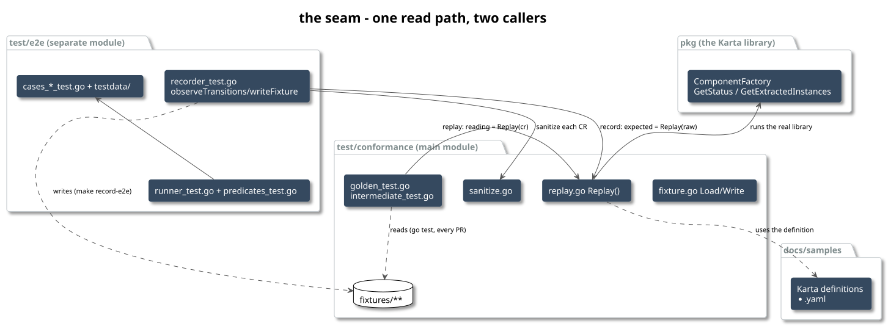
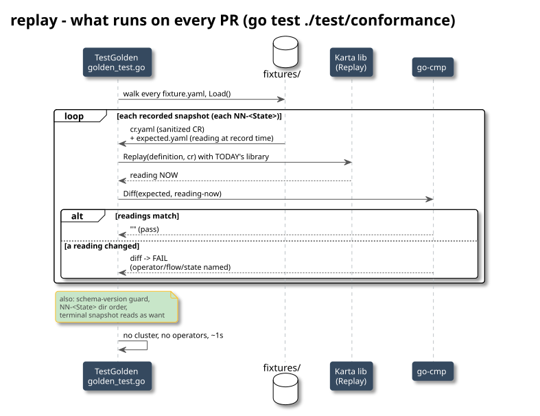

<!-- SPDX-License-Identifier: Apache-2.0 -->
<!-- Copyright (c) 2026 NVIDIA Corporation -->

# the karta conformance system - everything, end to end

this is the master doc: the whole thing we built, not just recording. it is a two-sided
testing system for the Karta library. one side (slow, needs a cluster) drives real
workloads with their real operators and records what Karta reads from them. the other side
(fast, offline, every PR) replays those recordings through today's library and fails if any
reading changed. it does NOT change library or CRD code - it is test infra plus recorded
data.

the deep line-by-line of the RECORD side is in `how-recording-works.md`; this doc covers the
whole system - both sides, the shared engine, every design decision, the enrichment, the
code map, and the PR plan. read it top to bottom once; the diagrams carry the shape.



---

## primitives (read first)

two families of ideas. the kubernetes side is explained in depth in `how-recording-works.md`;
here is the compact recap plus the Karta-library side you need for the replay half.

### kubernetes, in one paragraph each

- **object = spec + status.** spec is what you want (you write it); status is what is (the
  controller writes it). the recorder only reads status.
- **API server + etcd.** the one front door; every read/write goes through it.
- **resourceVersion.** an opaque version stamp that changes on every write to an object. used
  as a watch cursor ("changes since RV X") and for conflict detection. sanitize strips it, so
  two CRs that differ only in RV dedup to one.
- **CRD / CR.** a CRD registers a new kind (RayJob); a CR is an instance. built-ins (Pod,
  Job) need no CRD.
- **controller / operator / reconcile.** the program that drives a workload toward its spec.
  the recorder does not drive - it watches; the operator drives.
- **generation vs observedGeneration.** "has the controller caught up to the current spec?"
  - the basis of `statusSettled`.
- **watch.** a live stream of change events from the API server; how the recorder sees a
  workload's whole life.
- **GVK / dynamic client / unstructured.** talk to ANY kind generically (fields by path over
  a `map[string]interface{}`), so the recorder needs zero per-type Go code.

### the Karta library, in one paragraph each

- **a Karta definition** (`docs/samples/<kind>.yaml`) is itself a CR that teaches the library
  how to read one workload kind: `statusMappings` (each `ResourceStatus` - Running, Degraded,
  ... - is a rule over the workload's status: `byPhase`, `byConditions`, or a jq-ish
  `byExpression`) and component definitions (how to pull out instances and their replica
  `scale`).
- **the read entry point.** `resource.NewComponentFactoryFromObject(definition, workloadCR)`
  builds a factory; `factory.GetRootComponent().GetStatus()` returns `{MatchedStatuses,
  Phase}`; `factory.GetChildComponents()` + `GetExtractedInstances()` return the components
  and their scale. this is the ENTIRE surface the conformance system exercises.
- **`ResourceStatus`** is the enum the whole thing turns on: Running, Completed, Failed,
  Degraded, Suspended, Initializing, Undefined.
- **go-cmp (`cmp.Diff`)** is a structural diff; golden uses it to compare "what Karta read at
  record time" vs "what it reads now".

---

## 1. the two-sided design


the problem: Karta reads ANY workload CR and maps it to a `ResourceStatus` plus components.
to trust that you need real operator output, but you cannot run 15 operators on every PR. so
it splits:

- **record** (`make record-e2e`, needs a kind cluster): the real operator drives a real
  workload; the recorder watches, and for every distinct state it saves the raw CR and what
  Karta read from it, under `test/conformance/fixtures/`.
- **replay** (`go test ./test/conformance`, offline, every PR): load each saved CR, run
  today's library on it, and diff against the saved reading.

the two sides call the SAME `Replay` function (`test/conformance/replay.go`). that shared
seam is why they can never drift: the recorder stores `Replay`'s output as the expected, and
the golden test asserts the current library still produces it.

---

## the example, stepped through - batch-job/degraded, REAL recorded data

follow one flow like a debugger, one stop at a time, with the actual values. this is a real
recorded fixture (`test/conformance/fixtures/batch-job/v1.34.0/batch-v1-job/degraded/`), not
a toy. each stop names the place [file : function]. the punchline is at stop 12.

the inputs:

```
the workload  (testdata/batch-job/degraded.yaml): an Indexed Job, parallelism 2, completions 2,
              backoffLimit 0. index 0 runs `true` (succeeds at once); index 1 runs `sleep
              infinity` (stays active forever). so it settles Degraded and never finishes.

the flow      (cases_batch_job_test.go): states = [ {"Running", active>=1}, {"Degraded", jobDegraded()} ],  want = Degraded

the Karta def (docs/samples/batch-job.yaml):  initializing = active>0 and ready==0
                                              running      = active>0 and ready>0
                                              degraded     = parallelism>1 and ready<parallelism and (succeeded>0 or failed>0)
```

note two DIFFERENT rulesets: the flow's harness predicates (coarse: "Running" = active>=1) and
Karta's definition (fine: needs ready>0 to be Running). they will disagree at stop 5 - on
purpose.

---

**STOP 1  create the workload**  [runner_test.go : the flow It]
`k8sClient.Create(ctx, job)`. the API server stores it and returns it stamped
`metadata.resourceVersion: "r0"`. the Job controller (built into kube-controller-manager)
starts reconciling.

**STOP 2  open the watch**  [recorder_test.go : observeTransitions]
`initialRV = "r0"`. a `RetryWatcher` opens on `dynClient`, field-selector
`metadata.name=karta-e2e-job-degraded`, streaming every change after r0. (a batch/v1 Job has
no `observedGeneration`, so `statusSettled` will always return true here - gating is by the
predicates.)

**STOP 3  the controller creates pods -> first event**  [observeTransitions : the loop]
the controller creates 2 pods; `status.active` climbs to 2 (ready still 0). a MODIFIED event
arrives carrying the CR:
```
status: { active: 2, ready: 0, terminating: 0 }        resourceVersion: "r7"
```
- `classify()`: harness "Running" predicate `active>=1` -> TRUE; "Degraded" (`jobDegraded`,
  needs succeeded>0) -> false. most-advanced match = **"Running"**.
- gates: settled? yes. state != ""? yes.
- `sanitizedKey()`: strip volatile fields, marshal -> a key never seen. NEW.
- **capture** snapshot `{state:"Running", raw:{active:2,ready:0}}`.

**STOP 4  pods become ready -> second event**  [observeTransitions : the loop]
`status.ready` goes 0 -> 1. a new event:
```
status: { active: 2, ready: 1, terminating: 0 }        resourceVersion: "r9"
```
- `classify()`: still **"Running"** (active>=1; degraded still false).
- `sanitizedKey()`: this CR differs from stop 3 in a REAL field (`ready` 0 vs 1), so the key is
  DIFFERENT -> not seen -> NEW.
- **capture** snapshot `{state:"Running", raw:{active:2,ready:1}}`.
  => two snapshots, both labeled "Running", different CRs. hold that thought.

**STOP 5  index 0 succeeds -> terminal event**  [observeTransitions : the loop]
index 0's `true` exits: `succeeded` 0 -> 1, `active` 2 -> 1. event:
```
status: { active: 1, ready: 1, succeeded: 1, completedIndexes: "0", terminating: 0 }
```
- `classify()`: "Running" (active>=1) true, AND "Degraded" (`jobDegraded`: parallelism 2>1,
  ready 1<2, succeeded 1>0) TRUE. most-advanced = **"Degraded"**.
- **capture** `{state:"Degraded", raw:{active:1,ready:1,succeeded:1,...}}`. state == terminal
  -> `observeTransitions` returns.

captured, in order: `[Running(a2,r0), Running(a2,r1), Degraded(a1,r1,s1)]`.

**STOP 6  order check**  [recorder_test.go : assertObservedOrder]
`CollapseConsecutive([Running,Running,Degraded]) = [Running,Degraded]`. that is a monotonic
subsequence of the declared `[Running,Degraded]`, ending at the terminal `Degraded`. PASS.

**STOP 7  the LIVE gate**  [runner_test.go : the flow It]
run Karta on the final live object: `GetStatus().MatchedStatuses` -> `[Running, Degraded]`.
does it contain the flow's `want` (`Degraded`)? yes. PASS. (if the Job had NOT settled
Degraded, this fails HERE and stop 8 never runs - no wrong fixture.)

**STOP 8  sanitize each captured CR**  [recorder_test.go : writeFixture -> Sanitize]
the raw Job CR carries per-run junk. sanitize strips it:
```
before (raw):  metadata.resourceVersion: r7        after (sanitized): (gone)
               metadata.uid, creationTimestamp,                       (gone)
               managedFields, generation                             (gone)
               labels[batch.kubernetes.io/controller-uid: 9f3c-...]  (gone)
               status.startTime, uncountedTerminatedPods             (gone)
               spec: { parallelism, completions, template, ... }     kept
               status: { active, ready, succeeded, completedIndexes } kept
```

**STOP 9  the safety proof**  [recorder_test.go : writeFixture]
for each snapshot, run Karta twice: `Replay(RAW)` and `Replay(SANITIZED)`, assert equal. if
stripping a field changed the reading, recording fails now. it does not, so the sanitized CR
is safe to store.

**STOP 10  Replay produces the expected reading**  [replay.go : Replay -> the Karta library]
now the interesting part. Karta reads each sanitized CR using the DEFINITION's rules:

| snapshot (dir) | status | Karta's reading (expected.yaml) |
|---|---|---|
| `00-Running` | active 2, ready 0 | **`matchedStatuses: [Initializing]`** |
| `01-Running` | active 2, ready 1 | `matchedStatuses: [Running]` |
| `02-Degraded` | active 1, ready 1, succeeded 1 | `matchedStatuses: [Running, Degraded]` |

look at `00-Running`: the DIR is "Running" (the harness's own-field label, `active>=1`) but
Karta READS it `[Initializing]` (its rule needs `ready>0`). they disagree, and that is the
whole anti-circularity point: the dir label is our independent judgment; `expected.yaml` is
Karta's actual answer. if we had labeled dirs by Karta's answer, golden could never catch a
Karta bug - it would be grading its own homework. (all three also extract component `job`
with `scale.replicas: 2`.)

**STOP 11  write to disk**  [fixture.go : Write]
`os.RemoveAll` the flow dir, then write:
```
fixtures/batch-job/v1.34.0/batch-v1-job/degraded/
  fixture.yaml            observedStates: [Running, Degraded]   want: Degraded
  00-Running/  cr.yaml {active:2,ready:0}   expected.yaml [Initializing]
  01-Running/  cr.yaml {active:2,ready:1}   expected.yaml [Running]
  02-Degraded/ cr.yaml {active:1,ready:1,succeeded:1}  expected.yaml [Running, Degraded]
```
recording is done. no cluster is ever needed again for this flow.

---

now the OTHER side, months later, on a PR that touches the library - no cluster:

**STOP 12  replay + the payoff**  [golden_test.go : TestGolden]
`go test ./test/conformance` loads each snapshot and runs `cmp.Diff(expected, Replay(cr))`
with TODAY's library:
```
00-Running:  Replay({active:2,ready:0}) -> [Initializing]      == recorded [Initializing]     PASS
01-Running:  Replay({active:2,ready:1}) -> [Running]           == recorded [Running]          PASS
02-Degraded: Replay({active:1,ready:1,succeeded:1}) -> [Running,Degraded] == recorded          PASS
```
now suppose a PR "simplifies" the definition's running rule to `active>0` (drops `ready>0`).
replay of `00-Running` `{active:2,ready:0}` now returns `[Running]`, not the recorded
`[Initializing]`. `cmp.Diff` fails:
```
FAIL  batch-job/degraded/00-Running: matchedStatuses (-recorded +current)
        - Initializing
        + Running
```
**caught** - and ONLY because `00-Running` (the `active:2,ready:0` CR) was recorded even
though it shares the "Running" dir-label with `01-Running`. under one-snapshot-per-state,
`00` would not exist, this regression would ship green, and a workload that is really still
initializing would be reported Running in production. that single extra snapshot is the
entire reason for section 5.1.

---

## 2. recording (the live side) - summary


one Ginkgo `Describe` per operator case, `Ordered`; per flow it creates the workload,
watches it, checks the transition order, runs the live `want` gate, and (only under
`KARTA_RECORD=1`) writes fixtures. the heart is `observeTransitions`: it watches the workload
from its birth resourceVersion with a `RetryWatcher`, and for every settled event it

1. classifies the state from the workload's OWN fields (never Karta - avoids circularity),
2. captures a snapshot if the sanitized content is new (so every distinct CR is kept, not one
   per state),
3. fires any state action (e.g. unsuspend a resumed flow) once,
4. returns at the terminal state.

then the driver runs Karta on the final object and asserts `MatchedStatuses` contains the
flow's `want` - the live gate that makes a wrong fixture impossible, because a mis-induced
flow fails here before anything is written. full line-by-line in `how-recording-works.md`.

---

## 3. replay / golden (the offline side) - the actual PR guard



`test/conformance/golden_test.go`, `TestGolden`. this is the test that runs on every PR. it
walks every `fixture.yaml`, and per fixture:

1. **guard the schema version** - a stale-format fixture fails loudly ("re-record"), never
   silently mis-reads.
2. **replay every snapshot.** for each `NN-<State>` dir: `Replay(definition, cr.yaml)` with
   the CURRENT library, then `cmp.Diff(expected.yaml, reading-now)`. any difference fails,
   naming operator/flow/state. this is the regression guard.
3. **transition checks.** the snapshot dirs are `NN-<State>` in order, and collapsing their
   states reproduces the fixture's `observedStates`.
4. **terminal check.** the last snapshot reads as the flow's `want`.

there is a second offline test, `intermediate_test.go` (`TestFixturesRecordIntermediateCRs`):
it fails if NO recorded flow has a state repeated across distinct CRs. that is the shape a
revert to "one snapshot per state" would produce, so this test blocks that regression and
keeps the intermediate coverage honest. both run with `make test`, no cluster.

---

## 4. the shared engine (`test/conformance/*.go`)

### the fixture format (`fixture.go`)

one directory per operator, version, definition, flow:

```
test/conformance/fixtures/batch-job/v1.34.0/batch-v1-job/degraded/
  fixture.yaml            # index: schemaVersion, operator, version, kartaName, flow,
                          #        want, kartaFile, observedStates, snapshots[]
  00-Running/  cr.yaml expected.yaml
  01-Running/  cr.yaml expected.yaml     <- second distinct Running CR (intermediate coverage)
  02-Degraded/ cr.yaml expected.yaml
```

- `cr.yaml` is the sanitized workload CR; `expected.yaml` is what Karta read from it
  (matchedStatuses, phase, per-component instances + scale). a reviewer reads input and
  output side by side.
- the **version is a path segment**, read from the provisioner's `.installed-versions`. so
  recording a new operator version writes a new `.../v2/...` tree and keeps the old one;
  golden replays all versions it finds (this is the current+previous-N coverage goal).
- `Write` starts with `os.RemoveAll(root)` scoped to the ONE flow directory, so a re-record
  that yields fewer snapshots leaves no orphans and can never touch another version.
- everything marshals through `sigs.k8s.io/yaml` (JSON tags, sorted keys), so fixtures are
  diffable and stable-ordered.

### sanitize (`sanitize.go`) + the safety proof


`Sanitize` recursively strips `volatileKeys` (fields that differ between two recordings of
the same real state: resourceVersion, uids, timestamps, condition `message`, per-run pod /
Ray-job / replicaset ids, ...) and replaces `normalizeKeys` (fields read for PRESENCE but
whose value is a per-run timestamp, e.g. a CronJob `lastScheduleTime`) with a fixed
placeholder. it is a DENYLIST - anything not listed is kept, so a field Karta reads is never
silently dropped. the backstop that makes the denylist safe: the recorder runs Karta on the
RAW and the SANITIZED CR and asserts the two readings are identical before writing. if
stripping a field changed the reading, recording fails - nothing wrong lands on disk.

### replay (`replay.go`) - the one shared read path

`Replay(definition, cr)` runs `NewComponentFactoryFromObject` -> `GetStatus` ->
`GetChildComponents`/`GetExtractedInstances`, and projects the result into `Expected`
(matchedStatuses, phase, and per-component sorted instance keys + scale). it deliberately
drops the pod specs and mutated metadata inside the extracted instances - those churn run to
run and would make golden diffs noisy. both the recorder and golden call this exact function.

---

## 5. the design decisions (the "why", where review comments go)

### 5.1 record EVERY distinct CR, not one per state


the recorder dedups snapshots by SANITIZED CONTENT, not by state name. so a workload that
sits in `Running` across three genuinely different CRs yields three `NN-Running` snapshots,
and golden replays all three. the reason: golden replays each snapshot, so a library change
that would read a MIDDLE `Running` CR as `Degraded` is only caught if that middle CR was
recorded. one-snapshot-per-state would hide it. the accepted tradeoff: a re-record is not
byte-reproducible (which intermediate CRs a watch delivers is timing dependent); a fixture
set is a frozen regression baseline, refreshed on operator version bumps.

### 5.2 verify the transition ORDER in both modes

`observeTransitions` + `assertObservedOrder` run on a plain `make test-e2e`, not only under
record. so even a non-recording run asserts the workload went Initializing -> Running ->
terminal in a legal order (a monotonic subsequence of the declared states). before, the
non-record path only waited for the terminal and skipped intermediates.

### 5.3 the definition sha was dropped

golden used to pin `docs/samples/<def>.yaml` by sha and fail "re-record" on any byte change.
that fired even for a comment edit that changed no reading. dropped: golden is now a pure
library-regression test (run today's library on saved CRs, fail if a reading changed); a
definition edit that changes a reading surfaces as a normal field diff, one that changes
nothing is a no-op.

### 5.4 one package, files by role

a Ginkgo suite is one Go package = one directory, so cases/harness/recorder cannot be
separate subdirs without exporting a public framework API. instead the suite stays one
package with role-named files: `predicates_test.go` (how a state is recognized),
`runner_test.go` (the case model + the ginkgo driver), `recorder_test.go` (the
watch/capture/write engine), `cases_<type>_test.go` (the data). the vague "harness" file is
gone. a `framework/` sub-package is the follow-up if the machinery ever gets a second
consumer.

### 5.5 the replay engine + fixtures moved under `test/`

`internal/conformance` -> `test/conformance` (code) and the top-level `conformance/` ->
`test/conformance/fixtures/` (data). one place for the whole conformance area; the engine is
a normal package now (was `internal/`). `test/conformance` stays in the MAIN module so
golden runs with `make test`; `test/e2e` is a separate module so its cluster deps stay out of
the library.

---

## 6. enrichment - flows that SHOW the progression

flows were enriched to record `Initializing -> Running -> <terminal>` instead of jumping to
the terminal, using mechanisms matched to how Karta classifies each kind:

- **pod phase**: an init container holds the Pod `Pending` (`phaseEq Pending` -> `Running`).
- **Job active/ready**: a readiness probe holds the pod active but `ready==0`; Karta maps
  `active>0,ready==0` -> initializing, `active>0,ready>0` -> running. batch-job, jobset.
- **the `Created` condition**: an init container delays pods becoming Running so the
  operator's `Created` condition lingers. mpijob, pytorch.
- **operator phase**: dynamo (`state=pending`), grove (`availableReplicas<replicas`), nim
  (`NotReady->Ready`).

what is and is NOT inducible on CPU-only kind (documented in the case comments):

| operator | added | why the rest is not inducible here |
|---|---|---|
| pod, nim | Initializing->Running | - |
| batch-job, jobset, mpijob, pytorch | Initializing->Running (+ existing failed/suspended) | - |
| rayjob | + failed (exit 1) | - |
| dynamo, grove | + Initializing | dynamo `failed` stays `pending` on a crashing worker; grove `failed` needs a gang topology violation |
| milvus | Initializing observed | etcd/standalone too slow/flaky under load to reach Healthy in the record window |
| lws | Running only | `readyReplicas` absent during init + condition churn |
| knative | Running only | the sample maps only `Ready` |
| deployment, statefulset | Running only (+ failed/degraded) | controller init churns replica bookkeeping asynchronously |

milvus is a special case: its fixture predated a sanitize rule, and it could not be
live-re-recorded (flaky). the one-off `hack/resanitize` tool re-applies the current
`Sanitize` to a frozen fixture in place - no cluster - so it stays consistent; golden proves
the reading is unchanged.

---

## 7. the code map (where everything lives now)

```
docs/samples/<kind>.yaml          the Karta definitions (statusMappings, components)  [existing]

test/conformance/                 MAIN module - the offline engine, runs with `make test`
  fixture.go                      the on-disk schema: Fixture, Write, Load, SnapshotDir, CollapseConsecutive
  sanitize.go                     Sanitize: the volatile-field denylist + normalize list
  replay.go                       Replay: the ONE shared read path (recorder + golden both call it)
  golden_test.go                  TestGolden: replay every snapshot, diff vs recorded  <- the PR guard
  intermediate_test.go            TestFixturesRecordIntermediateCRs: guards the per-CR granularity
  conformance_test.go             round-trip unit tests for Write/Load
  fixtures/<op>/<ver>/<karta>/<flow>/   the recorded data (42 flows, 90 snapshots)

test/e2e/                         SEPARATE module - the live recorder (needs a cluster)
  suite_test.go                   ginkgo bootstrap: TestE2E, BeforeSuite, the k8s clients
  predicates_test.go              the readyFunc predicates (condTrue, phaseEq, jobDegraded, ...)
  runner_test.go                  workloadCase/flow types + run() + the Describe (the driver)
  recorder_test.go                observeTransitions, classify, sanitizedKey, writeFixture
  recorder_unit_test.go           offline unit tests for the recorder logic
  cases_test.go                   the aggregation slice
  cases_<type>_test.go            17 per-type case definitions
  testdata/<type>/<flow>.yaml     the workload manifests, grouped by type

hack/e2e/                         the kind provisioner (install operators, WORKLOADS/E2E_LABELS)  [base commit]
hack/resanitize/                  one-off: re-apply current Sanitize to a frozen fixture
Makefile                          record-e2e = test-e2e + KARTA_RECORD=1; E2E_LABELS -> ginkgo label filter
```

---

## 8. the first small PR

the branch holds a lot; PR-1 should land the reusable infra + ONE worked example + the
offline tests, and defer the operator breadth.

**include:** `test/conformance/{fixture,sanitize,replay}.go` + `{golden,intermediate,
conformance}_test.go` (the engine + the PR guard); `test/e2e/{suite,predicates,runner,
recorder,recorder_unit}_test.go` + `go.mod` (the recorder); ONE example case - `pod` - with
`cases_pod_test.go`, `cases_test.go` (just podCase), `testdata/pod/*.yaml`, and
`test/conformance/fixtures/pod/**`; the Makefile targets; the two READMEs trimmed to pod.

**why pod:** built-in (a reviewer needs no operator install), and the richest example -
`Initializing -> Running -> {Completed,Failed}` with intermediate CRs, which demonstrates the
whole record -> sanitize -> replay -> golden loop.

**defer:** the other 14 operators (their `cases_<type>_test.go`, `testdata/<type>/`,
`fixtures/<op>/**`) grouped into per-family follow-ups; `hack/resanitize` (ships with milvus);
the enrichment breadth (mechanisms are in the harness, the enriched non-pod flows ship with
their operators).

**review checklist:** (1) per-CR frozen baseline - ok? (2) dedup key = json-of-sanitized -
right? (3) sanitize denylist - any field a future mapping wants? (4) one-package var
aggregation vs a registry? (5) resanitize as a committed tool - keep or re-record on a fresh
cluster? sha-drop and the `test/conformance` move are already applied.

---

## 9. what is NOT covered (honest gaps)

- **milvus**: live re-record on a fresh cluster and add the Initializing state back; drop the
  resanitize shim for it.
- **Suspending / Resuming** `ResourceStatus`: no bundled sample maps them, so they are
  unreached.
- **controller init** (deployment/statefulset/lws): churns; kept at the settled state.
- **operator version bump automation** (epic #140): the schema guard already fails loudly on
  drift; the bump job re-records and a human reviews the new baseline.
